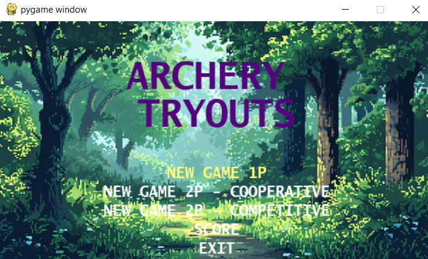
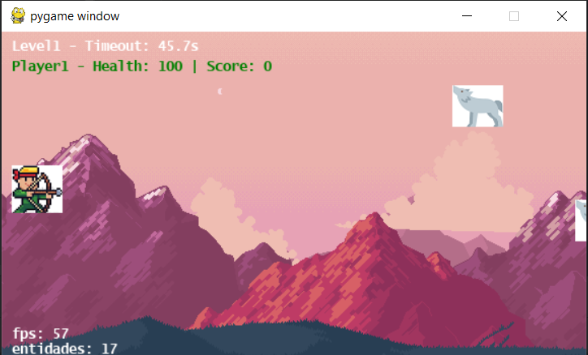

 ARCHERY TRYOUTS 
===============
 

### About

ARCHERY TRYOUTS is a 2D arcade game developed with Pygame. The game has 2 levels and each level level end with a timeout event.
Can be played coop (2 players).
Score is saved in database (SQLite3))

### Feel free if you want to contribute.

HOW TO PLAY

PLAYER 1:

PLAYER_KEY_UP = ⬆
PLAYER_KEY_DOWN = ⬇
PLAYER_KEY_LEFT = ⬅
PLAYER_KEY_RIGHT = ⮕
PLAYER_KEY_SHOOT = RIGHTCTRL

PLAYER 2:

PLAYER_KEY_UP = W
PLAYER_KEY_DOWN = S
PLAYER_KEY_LEFT = A
PLAYER_KEY_RIGHT = D
PLAYER_KEY_SHOOT = LEFTCTRL

GAME MENU

GAME LEVEL 1

